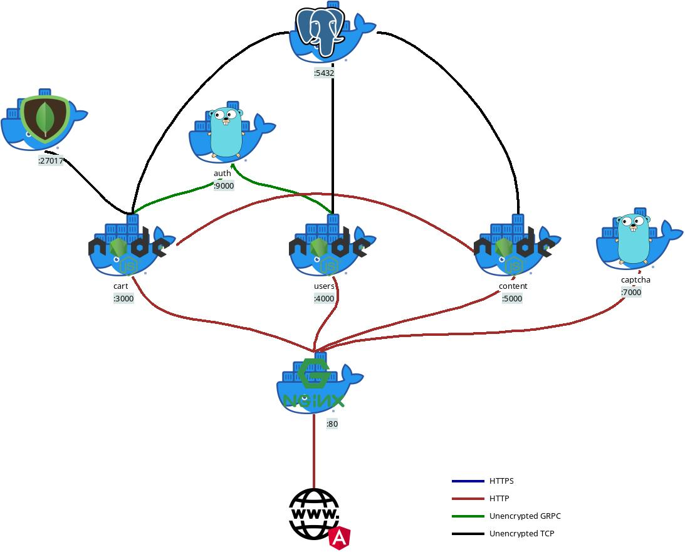
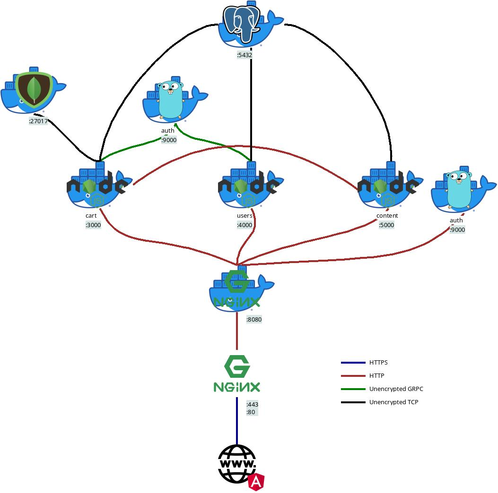

# Super mock (V2)

This is version 2 of the super mock application, an application to learn and practice automation.

This version uses microservices in backend and SPA in frontend, and code quality is better compared with v1,
but still the application is obviously **not production-ready** and **intentionally** lacks of high standards.

Version 1, which is stored in branch v1.

## Architecture



## Deploy

Execute [deploy.sh](deploy.sh).

Using curl:

```bash
curl -o deploy.sh https://raw.githubusercontent.com/BenjaminGuzman/webmock/v2/deploy.sh && chmod u+x deploy.sh
./deploy.sh -h
```

Using wget:

```bash
wget -O deploy.sh https://raw.githubusercontent.com/BenjaminGuzman/webmock/v2/deploy.sh && chmod u+x deploy.sh
./deploy.sh -h
```

The script will download all configuration files required (docker-compose.yml and .env with default configurations)
and modifies them depending on the given options.

Note: This deploy option use already built docker images available [here](https://hub.docker.com/u/guzmanbenjamin)

### TLS

If you want to add TLS, the following architecture is suggested



More clearly, just add a non-dockerized nginx server with 2 main purposes:

1. Act as reverse proxy, i.e. forward all requests to (dockerized) nginx plain HTTP server at 127.0.0.1:8080

2. Handle TLS. The server should have open port 443 and (optionally) port 80 to redirect to https.

To add TLS to the non-dockerized nginx server [certbot](https://certbot.eff.org/) and 
[Let's Encrypt](https://letsencrypt.org/) are recommended.

## Develop

If you want to run the project locally you'll need to spin up the angular server (described in Frontend section) and 
all the backend microservices (described in Backend section)

### Databases

All the database init files are stored in [mongo](mongo) and [postgres](postgres).

If you want to change a user, password, privileges or whatever, you can do it inside the configuration files provided
in those directories.

Even though v2 is intended to be more professional, security configurations for database are a little bit neglected
just for sake of simplicity (e.g. users are database administrators, user-password is used as authentication method).
But remember **this is a mock app** and you should <u>take security seriously in real-world project</u>.

### Backend

In order to run all backend microservices you need to execute `npm run start` (or `npm run start:dev`) from within each
microservice directory, e.g. to start the _users_ microservice you need to be located inside 
[`backend/users`](backend/users) and run `npm run start`.

If you don't want to set up a PostgreSQL or MongoDB database in your machine, you could simply start a docker
container with `docker compose -f docker-compose-psql.yml up` or `docker compose -f docker-compose-mongo.yml up`.

**Pro tip**: If you want to easily start everything in development mode, simply use
[Microstart](https://github.com/BenjaminGuzman/microstart). Check [`microstart.yml`](microstart.yml)

**Note**: The content microservice doesn't require authentication (JWT) because its contents are public anyway
(Deezer API is consumed).

**Why there is no GraphQL gateway?**

For production mode, nginx serves as HTTP gateway/reverse proxy.

However, it was not really considered during the architecture design phase just to keep things simple.

In a real-world project you may want to use a gateway and probably use 
[GraphQL Federation](https://www.apollographql.com/docs/federation) or something similar.

A GraphQL gateway would also be very useful for the cart microservice because it could simply store the tracks ids and
to query cart information the gateway queries both microservices, cart (to get the track ids in the shopping cart) and
content (to get the actual data for the tracks).

If you want to learn and practice, you could add a gateway anyway, remember this is **open source** and its sole
purpose is to **learn and practice**.

### Frontend

Simply run `npm run start` from within the [`frontend`](frontend) directory.

## Administration

A CLI administration tool is likely to be included in the future.

This tool let you:

- Insert music
- Delete music
- Delete all users

## License


